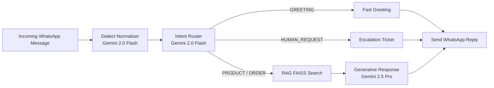

<div align="center">
  
  <a href="https://github.com/AHMEDGabal1/arabbot-studio">
    
  </a>

  <h1>
    
    ArabBot Studio
  </h1>

  <p><strong>The Ultimate AI Chatbot Platform for Egyptian SMBs — on WhatsApp, in Egyptian Arabic.</strong></p>

  <p>
    
    
    
    
    
    
    
  </p>

  <p>
    <i>A no-code platform empowering restaurants, clinics, e-commerce stores, and agencies<br>
    to build & deploy intelligent WhatsApp Business agents.<br>
    Understands <b>العامية المصرية</b> natively, connects to your tools, and works 24/7.</i>
  </p>

</div>

<br>
<hr>

## ✨ Key Features

- **🇪🇬 Native Egyptian Arabic AI** — Understands local slang and idioms (العامية المصرية), not just Modern Standard Arabic.
- **💬 WhatsApp Business Integration** — One-click Meta webhook verification and seamless message handling.
- **🧠 Advanced RAG Engine** — Upload your FAQs and let the AI generate accurate answers based on your internal data using FAISS vector search.
- **🎯 9-Intent Classifier** — Intelligent routing for Greetings, Orders, Complaints, FAQs, and more.
- **🤝 Human Handoff** — Automatically escalates complex issues to a real human agent when the AI reaches its limits.
- **🛡️ Multi-Tenant Architecture** — Complete data isolation across workspaces with strict JWT role-based authentication.
- **📊 Real-time Analytics** — Monitor message volume, intent distribution, and processing times from a beautiful dashboard.
- **🎨 Warm Constructivist UI** — A premium, distinctive design system built with Tailwind CSS (Navy, Terracotta, and Gold palette).

<br>

## 🏛️ Architecture & Tech Stack

ArabBot Studio is built on a highly scalable, asynchronous architecture designed for sub-second WhatsApp webhook acknowledgments and fast LLM inference.

### Tech Stack
- **Frontend**: React 19, TypeScript, Vite 8, Tailwind CSS 4, Recharts
- **Backend**: FastAPI, Async Python, SQLAlchemy, PostgreSQL 16, Redis
- **AI/ML**: LangChain 0.3, Google Gemini 2.0 (Flash & Pro), FAISS (Local Vector Store)

### 🧠 The AI Pipeline

The chatbot processes incoming WhatsApp messages through 5 sequential, highly optimized stages:



<br>

## 🚀 Quick Start Guide

### Prerequisites
- Python 3.12+ and Node.js 20+
- PostgreSQL 16+ (or SQLite for local dev)
- Redis 7+
- **Google Gemini API Key** (Required for AI routing and generation)

### 1. Backend Setup

```bash
git clone https://github.com/AHMEDGabal1/arabbot-studio.git
cd arabbot-studio/backend

# Create and activate virtual environment
python -m venv .venv
source .venv/bin/activate  # On Windows: .venv\Scripts\activate

# Install dependencies
pip install -r requirements.txt
```

### 2. Environment Configuration

```bash
cp .env.example .env
```
Edit your `.env` file. You must set `DATABASE_URL`, `GOOGLE_API_KEY`, and a strong `SECRET_KEY`.

### 3. Database & Migrations

```bash
# Apply database schema
alembic upgrade head
```

### 4. Start the Application

**Run the Backend (Port 8000)**
```bash
python -m uvicorn src.main:app --reload --port 8000
```

**Run the Frontend (Port 5173)**
```bash
cd ../frontend
npm install
npm run dev
```

Visit `http://localhost:5173` to access your ArabBot Studio dashboard!

<br>

## 🛡️ Production Readiness

As of **July 2026 (Audit v3)**, ArabBot Studio is **conditionally ready for production deployment**. 

✅ All critical vulnerabilities resolved.<br>
✅ Strict Workspace Data Isolation implemented.<br>
✅ Concurrent Vector Store Race Conditions handled.<br>
✅ WhatsApp Webhooks hardened and optimized.<br>

<br>

## 📖 API Reference Highlights

All protected routes require an `Authorization: Bearer <jwt_token>` header.

- `POST /api/v1/auth/login` - Authenticate and get JWT.
- `GET /api/v1/bots` - List all bots in the active workspace.
- `POST /api/v1/bots/{bot_id}/knowledge` - Add FAQ items and embed them into the FAISS index.
- `GET /api/v1/conversations` - Fetch all user chats.
- `POST /webhooks/whatsapp/{bot_id}` - Secure webhook endpoint for Meta integration (HMAC verified).

*(Interactive API documentation is available at `http://localhost:8000/docs` when the server is running).*

<br>

## 👨‍💻 Contributing & License

Private Repository — All rights reserved. 
**ArabBot Studio © 2026.**

---
<div align="center">
  <b>Built with ❤️ for Egyptian SMBs</b><br>
  <i>خلينا نشغل البوت بدل ما ترد على نفس السؤال ١٠٠ مرة في اليوم</i>
</div>
