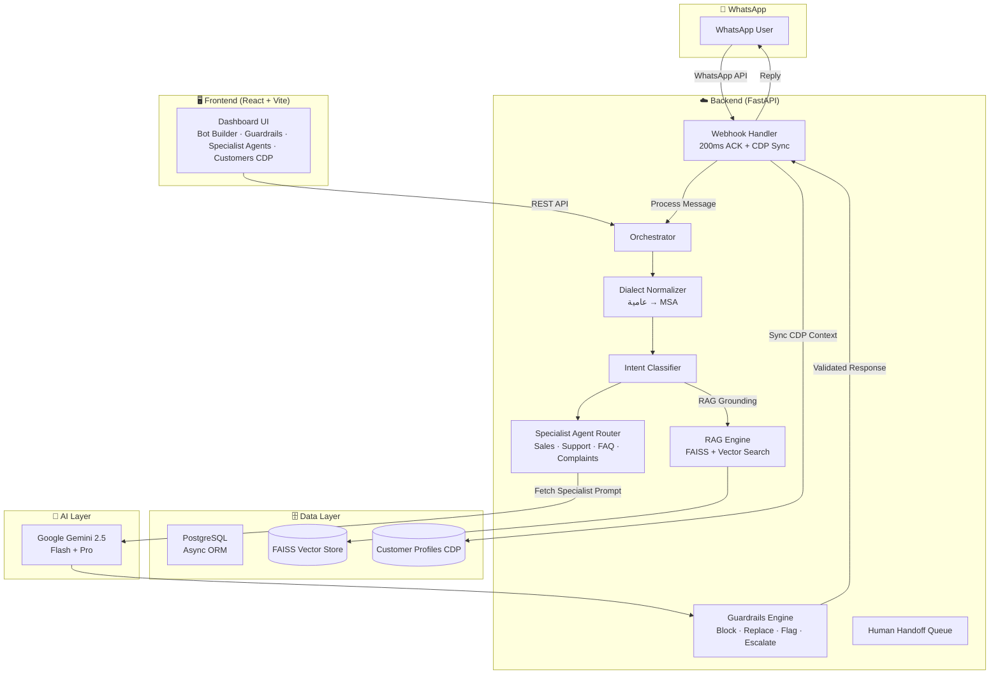

<p align="center">
  
</p>

<p align="center">
  <a href="LICENSE"></a>
  <a href=".github/workflows/ci.yml"></a>
  
  
  
  
  
  
  
</p>

<h1 align="center">
  
  ArabBot Studio
</h1>
<p align="center"><strong>The Open Source Arabic-First AI Agent Studio for MENA — on WhatsApp, in Egyptian & Gulf Dialects</strong></p>

<p align="center">
  <i>An open-source, multi-tenant AI Agent platform that empowers businesses and developers to<br>
  build & deploy autonomous AI agents for WhatsApp Business —<br>
  understands العامية المصرية & Gulf dialects, enforces business guardrails, routes to specialist agents, and tracks customer memory 24/7.</i>
</p>


## Recent Updates

- **🚀 Phase 2A Platform Release (July 2026):**
  - **🛡️ Guardrails & Safety Engine:** Priority-ordered pre & post-generation rules engine (Forbidden words, Max discount %, Required phrase disclaimers, ReDoS-protected regex matching, and character length limits with `block`, `replace`, `flag`, and `escalate` actions).
  - **🧠 Multi-Agent Specialist Routing:** Intent-based routing to dedicated specialized agent personas (Sales, Support, FAQ, Complaints) pre-seeded with Egyptian Arabic system prompts and customized temperatures.
  - **👤 Customer Profiles & CDP Memory:** Permanent cross-channel memory tracking customer tags, internal agent notes, interaction counts, and personalized context injection into LLM prompts.
  - **💬 WhatsApp-Themed Landing & Tabbed Bot Editor:** Redesigned landing page with WhatsApp Emerald Green styling and tabbed Bot Editor UI (`General Settings`, `Specialist Agents`, `Safety & Guardrails`).

- **Production Readiness Audit v3 (July 2026):** All critical vulnerabilities (RCE, broken webhooks, hardcoded credentials) and high-severity issues (workspace isolation, concurrent vector store writes) patched.

---

## Features

- **Egyptian & Gulf Arabic AI** — Native understanding of العامية المصرية, Saudi/Gulf, Levantine, and MSA
- **🛡️ Guardrails Engine** — Prevent discount hallucinations, forbidden words, and enforce terms disclaimers
- **🧠 Specialist Agent Routing** — Dedicated AI agents for Sales, Support, FAQ, and Complaints
- **👤 Customer Profiles (CDP)** — Persistent customer memory, tags, agent notes, and cross-bot conversation history
- **WhatsApp Business API** — One-click connect, Meta Cloud API HMAC SHA256 webhook verified
- **RAG Knowledge Base** — Upload FAQs, AI answers with your data (FAISS vector search)
- **Human Handoff** — Escalate to human agent queue when confidence is low or requested
- **Workspace Isolation** — Strict multi-tenant data isolation per workspace
- **JWT Auth** — Secure API access with role-based workspace membership
- **Analytics Dashboard** — Message volume, intent distribution, response times, and customer metrics

---

## Tech Stack

| Layer | Technology |
|---|---|
| **Backend Framework** | FastAPI (async Python 3.12) |
| **Frontend Framework** | React 19 + TypeScript ~6.0 |
| **Build Tool** | Vite 8 |
| **CSS** | Tailwind CSS 4 |
| **Charts** | Recharts |
| **AI / LLM** | LangChain 0.3 + Google Gemini 2.5 Flash / Pro |
| **Database** | PostgreSQL 16 (async with asyncpg) / SQLite (dev) |
| **Vector Store** | FAISS (local embedding search) |
| **Cache / Queue** | Redis (background task queue) |
| **Auth** | JWT (python-jose) + bcrypt |
| **Migrations** | Alembic |
| **Testing** | pytest + pytest-asyncio (SQLite in-memory) |

---

## Architecture

> 💡 **Architecture Decision Records (ADRs):** We document all major technical choices in `docs/decisions/`. See [0001-initial-architecture.md](docs/decisions/0001-initial-architecture.md) and [0002-phase2a-guardrails-agents-cdp.md](docs/decisions/0002-phase2a-guardrails-agents-cdp.md).



---

## API Endpoints

### Authentication & Workspaces
- `POST /api/v1/auth/register` — Register user & workspace
- `POST /api/v1/auth/login` — Authenticate and receive JWT
- `GET /api/v1/auth/me` — Get current user profile

### Bots & Dialects
- `GET /api/v1/bots` — List workspace bots
- `POST /api/v1/bots` — Create new AI bot
- `GET /api/v1/bots/{bot_id}` — Get bot details
- `PATCH /api/v1/bots/{bot_id}` — Update bot prompt / dialect settings
- `DELETE /api/v1/bots/{bot_id}` — Soft-delete bot

### 🛡️ Guardrails Engine (Phase 2A)
- `GET /api/v1/bots/{bot_id}/guardrails` — List active guardrail rules
- `POST /api/v1/bots/{bot_id}/guardrails` — Create guardrail rule (`forbidden_word`, `max_discount`, `required_phrase`, `regex_block`, `max_length`)
- `PATCH /api/v1/bots/{bot_id}/guardrails/{rule_id}` — Update rule threshold or action (`block`, `replace`, `flag`, `escalate`)
- `DELETE /api/v1/bots/{bot_id}/guardrails/{rule_id}` — Delete rule

### 🧠 Specialist Agent Routing (Phase 2A)
- `GET /api/v1/bots/{bot_id}/agents` — List specialist agents
- `POST /api/v1/bots/{bot_id}/agents/seed-defaults` — 1-Click seed built-in Egyptian Arabic agents (Sales, Support, FAQ, Complaints)
- `POST /api/v1/bots/{bot_id}/agents` — Create custom specialist agent
- `PATCH /api/v1/bots/{bot_id}/agents/{agent_id}` — Update system prompt or intent mappings
- `DELETE /api/v1/bots/{bot_id}/agents/{agent_id}` — Delete agent config

### 👤 Customer Profiles & CDP (Phase 2A)
- `GET /api/v1/customers` — List/search customer profiles (by name, phone, or tag filter)
- `GET /api/v1/customers/{profile_id}` — Get customer profile details
- `PATCH /api/v1/customers/{profile_id}` — Update display name, phone, email, tags, and internal agent notes
- `GET /api/v1/customers/{profile_id}/conversations` — Get customer cross-bot conversation history

---

## Quickstart

### Backend Setup
```bash
cd backend
pip install -r requirements.txt
python -m pytest tests/ -v          # Run full test suite (26 passing tests)
python -m uvicorn src.main:app --reload --port 8000
```

### Frontend Setup
```bash
cd frontend
npm install
npm run dev                         # Start dev server at http://localhost:5173
npm run build                       # Production build
```

---

## 🤝 Contributing & Community

ArabBot Studio is open source and community-driven! We welcome contributions, feature ideas, and bug reports.

- 📖 **[Contributing Guidelines](CONTRIBUTING.md)** — Step-by-step setup, test guidelines, and PR workflow.
- 📜 **[Code of Conduct](CODE_OF_CONDUCT.md)** — Community standards and expectations.
- 🛡️ **[Security Policy](SECURITY.md)** — Responsible vulnerability disclosure instructions.

---

## 📄 License

Distributed under the MIT License. See [`LICENSE`](LICENSE) for details.

